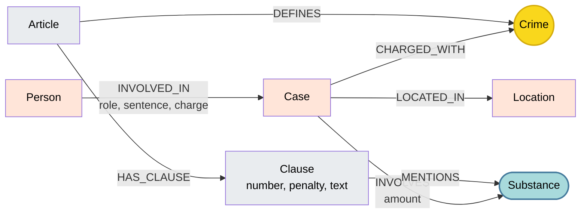

# Thiết kế Ontology — Day 19

**Họ tên:** Đặng Quốc Cường  **MSSV:** 2A202602466

**Lựa chọn** (đánh dấu một):
- [x] Dùng ontology gợi ý (có thể chỉnh nhỏ)
- [ ] Tự thiết kế (xét bonus +15, xem `SUBMISSION.md`)

> Hướng dẫn: `LAB_GUIDE.md` Bước 2. Dùng ontology gợi ý thì vẫn phải điền đủ các mục dưới đây bằng lời của bạn.

## 1. Sơ đồ

Sơ đồ mô hình dữ liệu đồ thị tri thức (Knowledge Graph) liên kết 2 Knowledge Base: Văn bản quy phạm pháp luật (`law`) và Tin tức báo chí (`news`).

Node **Crime** đóng vai trò là **node cầu nối trọng tâm** (được tô màu vàng), và node **Substance** đóng vai trò là **cầu nối bổ trợ** (tô màu xanh nhạt).

---

## 2. Entity types (node labels)

| Label | Ý nghĩa | Khóa định danh (`MERGE` theo) | Properties | Lấy từ KB nào | Trích bằng (regex / LLM / khác) |
| --- | --- | --- | --- | --- | --- |
| **Article** | Điều luật (Bộ luật Hình sự, Luật PCMT) | `id` (e.g. `"Điều 251 BLHS"`) | `id`, `title`, `law`, `doc_id` | `law` | Regex từ front matter và tiêu đề điều luật |
| **Clause** | Khoản trong điều luật quy định tình tiết định khung và mức phạt | `id` (e.g. `"Điều 251 BLHS khoản 1"`) | `id`, `number`, `penalty`, `text`, `doc_id` | `law` | Regex (`CLAUSE_START`, regex bắt khung phạt) |
| **Crime** *(Cầu nối)* | Tội danh pháp lý chuẩn hóa | `name` (e.g. `"mua bán trái phép chất ma túy"`) | `name` | Cả hai (`law` định nghĩa, `news` vi phạm) | Regex lấy từ tiêu đề `Article` (với luật); LLM trích xuất kết hợp `link_entity` (với tin) |
| **Substance** *(Bổ trợ)* | Chất ma túy hoặc tiền chất | `name` (e.g. `"MDMA"`, `"Ketamine"`, `"Heroine"`) | `name` | Cả hai | String match theo danh sách `SUBSTANCES` (luật); LLM trích xuất (tin) |
| **Case** | Vụ án / vụ việc phạm tội ma túy cụ thể | `name` (e.g. `"Vụ mua bán hơn 36kg ma túy tại TP.HCM"`) | `name`, `summary`, `date`, `doc_id`, `source_title` | `news` | LLM trích xuất JSON (`NEWS_EXTRACTION_PROMPT`) |
| **Person** | Cá nhân liên quan (bị can, bị cáo, nghi phạm,...) | `name` (e.g. `"Lê Minh Thành"`, `"Dương Minh Tuấn"`) | `name`, `aliases` (list chuỗi biệt danh) | `news` | LLM trích xuất JSON |
| **Location** | Địa bàn xảy ra vụ việc hoặc địa danh xét xử | `name` (e.g. `"TP.HCM"`, `"Hà Nội"`) | `name` | `news` | LLM trích xuất JSON |

---

## 3. Relationships

| Type | Từ → Đến | Properties trên cạnh | Ý nghĩa |
| --- | --- | --- | --- |
| **DEFINES** | `Article` → `Crime` | *(không có)* | Điều luật quy định định nghĩa pháp lý cho tội danh |
| **HAS_CLAUSE** | `Article` → `Clause` | *(không có)* | Điều luật bao gồm các khoản quy định chi tiết khung hình phạt |
| **MENTIONS** | `Clause` → `Substance` | *(không có)* | Khoản luật quy định hình phạt có viện dẫn/áp dụng cho loại chất ma túy cụ thể |
| **CHARGED_WITH** | `Case` → `Crime` | *(không có)* | Vụ án bị cơ quan chức năng khởi tố, truy tố hoặc xét xử theo tội danh |
| **INVOLVES** | `Case` → `Substance` | `amount` (e.g. `"hơn 36kg"`, `"hơn 9,6kg"`) | Vụ việc liên quan đến loại chất ma túy nào và khối lượng tang vật tương ứng |
| **LOCATED_IN** | `Case` → `Location` | *(không có)* | Địa bàn hành chính nơi xảy ra vụ án hoặc nơi mở phiên tòa |
| **INVOLVED_IN** | `Person` → `Case` | `role` (bị cáo, bị can, người liên quan...), `charge` (tội danh), `sentence` (mức án) | Cá nhân tham gia vào vụ án với vai trò, tội danh cá nhân và mức hình phạt cụ thể |

---

## 4. Node cầu nối giữa 2 KB

- **Node nào:** 
  - **`Crime`** là node cầu nối chính kết nối giữa thực thể vụ án (`Case`) của KB tin tức và điều luật (`Article`) của KB luật pháp.
  - **`Substance`** là node cầu nối bổ trợ kết nối giữa tang vật của vụ án (`Case`) và các quy định định lượng trong từng khoản luật (`Clause`).
- **Vì sao chọn node này:**
  - Trong các bài báo pháp luật, nhà báo luôn đề cập vụ án/bị can bị khởi tố hoặc xét xử về **tội danh** nào (ví dụ: *"về tội mua bán trái phép chất ma túy"*).
  - Trong Bộ luật Hình sự, mỗi điều luật của Chương XX đều **định nghĩa một tội danh cụ thể** (ví dụ: *"Điều 251. Tội mua bán trái phép chất ma túy"*).
  - Nhờ có `Crime`, một truy vấn từ đối tượng trong tin tức có thể duyệt đồ thị trực tiếp sang điều luật tương ứng thông qua:
    `(:Person)-[:INVOLVED_IN]->(:Case)-[:CHARGED_WITH]->(:Crime)<-[:DEFINES]-(:Article)`.
- **Cách đảm bảo hai phía khớp tên:**
  - **Chuẩn hóa chuỗi (`normalize_crime`):** Chuyển về chữ thường, chuẩn hóa khoảng trắng, loại bỏ dấu ngoặc kép/ngoặc đơn, và cắt bỏ tiền tố `"tội "`.
  - **Ràng buộc đầu vào LLM:** Đưa danh sách các tội danh chuẩn từ KB luật (`DANH SÁCH TỘI DANH`) vào prompt trích xuất của LLM và yêu cầu LLM bắt buộc chọn đúng nguyên văn.
  - **Hậu kiểm và liên kết thực thể (`link_entity`):** Sử dụng hàm `link_entity` kiểm tra so khớp tuyệt đối trước; nếu có sai lệch nhỏ về chính tả (ví dụ bỏ dấu *"tuý"* vs *"túy"*), sử dụng `difflib.get_close_matches(cutoff=0.8)` để map về đúng tên chuẩn trong văn bản luật. Nếu không khớp trên ngưỡng 0.8 thì trả về `None`, tránh tình trạng ghép nối bừa bãi.
- **Khi nào cầu gãy, và bạn xử lý thế nào:**
  - **Nguyên nhân gãy cầu:** 
    1. Báo chí dùng ngôn ngữ đời thường thay vì thuật ngữ pháp lý chuẩn (ví dụ viết *"phê ma túy"*, *"chơi thuốc lắc"*, *"buôn ma túy"* thay vì *"tổ chức sử dụng trái phép..."* hay *"mua bán trái phép..."*).
    2. Vụ việc mới bắt giữ, chưa có kết luận tội danh khởi tố chính thức.
    3. LLM trích xuất bị sai lệch hoặc hallucination.
  - **Cách xử lý:**
    1. Thiết lập ngưỡng fuzzy threshold nghiêm ngặt (`cutoff=0.8`) trong `link_entity` để chỉ chấp nhận biến thể chính tả gần.
    2. Trong kiến trúc hybrid GraphRAG, nếu đường đi trên đồ thị bị gãy (không tìm thấy facts nối sang điều luật), pipeline vẫn lấy các chunks văn bản có độ tương đồng vector cao từ `EmbeddingStore` đưa vào prompt cho LLM, ngăn chặn việc thiếu thông tin.

---

## 5. Competency questions

Với mỗi câu trong `data/benchmark_kg.json`, ghi đường đi trên graph dùng để trả lời:

| Câu | Đường đi (Cypher pattern) | Trả lời được? |
| --- | --- | --- |
| **Q1** *(single-hop-law)* | `MATCH (a:Article)-[:HAS_CLAUSE]->(cl:Clause) WHERE a.id = 'Điều 2 PCMT' AND cl.number = 2 RETURN cl.text` | **Được**. Trả lời trực tiếp qua định nghĩa tiền chất tại Khoản 2 Điều 2 Luật PCMT được lưu ở node `Clause` (kết hợp vector retrieval của chunk luật). |
| **Q2** *(single-hop-news)* | `MATCH (p:Person)-[r:INVOLVED_IN]->(k:Case) WHERE (k.name CONTAINS "36kg" OR k.summary CONTAINS "36kg") AND toLower(r.sentence) CONTAINS "tử hình" RETURN p.name, r.sentence` | **Được**. Đồ thị trích xuất được `Case` 36kg ma túy, các `Person` (`Trần Thanh Tuấn`, `Trần Minh Tâm`) có quan hệ `INVOLVED_IN` chứa thuộc tính `sentence: "tử hình"`. |
| **Q3** *(cross-kb)* | `MATCH (p:Person {name: "Lê Minh Thành"})-[r:INVOLVED_IN]->(k:Case)-[:CHARGED_WITH]->(c:Crime)<-[:DEFINES]-(a:Article)-[:HAS_CLAUSE]->(cl:Clause {number: 1}) RETURN p.name, r.sentence, c.name, a.id, cl.penalty` | **Được**. Đi từ `Person` ("Lê Minh Thành") → mức án 36 tháng tù → `Case` → `Crime` ("mua bán trái phép chất ma túy") → `Article` ("Điều 251 BLHS") → `Clause 1` ("phạt tù từ 02 năm đến 07 năm"). |
| **Q4** *(cross-kb)* | `MATCH (p:Person)-[r:INVOLVED_IN]->(k:Case)-[:CHARGED_WITH]->(c:Crime)<-[:DEFINES]-(a:Article)-[:HAS_CLAUSE]->(cl:Clause) WHERE p.name = "Dương Minh Tuấn" OR "Hoàng Nato" IN p.aliases RETURN p.name, c.name, a.id, cl.number, cl.penalty` | **Được**. Seed từ biệt danh `Hoàng Nato` trong `aliases` của `Person` → `Case` → `Crime` ("tổ chức sử dụng trái phép chất ma túy") → `Article` ("Điều 255 BLHS") → các `Clause` để tìm khung cao nhất (khoản 4: 20 năm hoặc tù chung thân). |
| **Q5** *(cross-kb-multi-hop)* | `MATCH (p:Person {name: "Cái Quang Huy"})-[r:INVOLVED_IN]->(k:Case)-[:CHARGED_WITH]->(c:Crime)<-[:DEFINES]-(a:Article)-[:HAS_CLAUSE]->(cl:Clause), (k)-[inv:INVOLVES]->(s:Substance) WHERE (cl)-[:MENTIONS]->(s) RETURN c.name, s.name, inv.amount, a.id, cl.number, cl.penalty, cl.text` | **Được (kết hợp suy luận LLM)**. Graph cung cấp đầy đủ liên kết: Cái Quang Huy → tội vận chuyển trái phép chất ma túy → Điều 250 BLHS; tang vật có MDMA lượng hơn 9,6kg; và các Clause của Điều 250 nhắc đến MDMA. Dựa trên facts ngữ cảnh này, LLM suy luận số học: > 100g thuộc khoản 4 (20 năm, chung thân hoặc tử hình). |
| **Q6** *(aggregation)* | `MATCH (k:Case)-[:INVOLVES]->(s:Substance {name: "MDMA"}) RETURN k.name, k.summary` | **Được**. Tập hợp tất cả các node `Case` có quan hệ `INVOLVES` đến `Substance` tên `"MDMA"` (Vụ Cái Quang Huy, Vụ Lê Minh Thành, Vụ Viện Pháp y tâm thần...). |

---

## 6. Quyết định thiết kế và đánh đổi

1. **Quyết định 1: Dùng `Crime` làm node cầu nối độc lập thay vì nối thẳng `Case` sang `Article`**
   - *Đã chọn:* Tạo node nhãn `Crime` đứng giữa: `(Case)-[:CHARGED_WITH]->(Crime)<-[:DEFINES]-(Article)`.
   - *Phương án khác:* Cho quan hệ nối trực tiếp `(Case)-[:VIOLATES]->(Article)`.
   - *Vì sao chọn:* Bài báo tin tức thường chỉ nêu tên hành vi/tội danh mà hiếm khi nêu số Điều luật chính xác. Tách `Crime` làm node riêng giúp việc chuẩn hóa danh mục tội danh độc lập, dễ áp dụng fuzzy matching (`link_entity`), và cho phép nhiều vụ án khác nhau cùng trỏ tới một node tội danh dùng chung.

2. **Quyết định 2: Tách cấu trúc văn bản Luật thành `Article` và `Clause` bằng Regex thay vì dùng LLM**
   - *Đã chọn:* Dùng biểu thức chính quy (`CLAUSE_START`, `re.search` hình phạt) để trích xuất cấu trúc văn bản luật xác định (deterministic).
   - *Phương án khác:* Đưa toàn bộ file luật vào LLM để sinh JSON schema.
   - *Vì sao chọn:* Văn bản quy phạm pháp luật Việt Nam có cấu trúc chia Điều, Khoản, Điểm cực kỳ khuôn mẫu và nhất quán. Dùng Regex đạt độ chính xác 100%, chi phí 0 USD, tốc độ xử lý tức thì và không bị hiện tượng ảo giác (hallucination) làm mất khoản hoặc sai lệch số năm tù.

3. **Quyết định 3: Lưu `role`, `sentence`, `charge` làm thuộc tính trên quan hệ `INVOLVED_IN` thay vì tạo node riêng**
   - *Đã chọn:* `(Person)-[:INVOLVED_IN {role, sentence, charge}]->(Case)`.
   - *Phương án khác:* Tạo node `Sentence` (Mức án) hoặc gán thuộc tính mức án vào thẳng node `Person`.
   - *Vì sao chọn:* Vai trò và mức án của một cá nhân chỉ có ý nghĩa gắn liền với một vụ án cụ thể. Việc đưa vào thuộc tính quan hệ giúp đồ thị súc tích, tránh bùng nổ số lượng node không cần thiết, và các câu truy vấn Cypher tìm người chịu án (như Q2) được thực hiện nhanh gọn.

4. **Quyết định 4: Lưu `amount` (khối lượng tang vật) dưới dạng text trên quan hệ `INVOLVES` thay vì phân rã thành số thực (float)**
   - *Đã chọn:* Lưu chuỗi text nguyên văn do LLM trích xuất (e.g. `"hơn 36kg"`, `"hơn 9,6kg"`, `"5 viên"`).
   - *Phương án khác:* Viết bộ quy đổi đơn vị phức tạp để lưu thuộc tính số `amount_grams: float`.
   - *Vì sao chọn:* Báo chí dùng nhiều cách diễn đạt phong phú và đơn vị dân gian (*"5 viên kẹo"*, *"nửa chỉ"*, *"1.000 đầu pod"*). Việc ép kiểu sang gram rất dễ sai sót hoặc mất ngữ nghĩa. Để dạng text và chuyển vào context prompt giúp LLM tận dụng khả năng đọc hiểu tự nhiên để đối chiếu với các ngưỡng định lượng trong điều luật.

---

## 7. So với ontology gợi ý (bắt buộc nếu xét bonus)

| Điểm khác | Gợi ý làm gì | Bạn làm gì | Vấn đề nó giải quyết | Bằng chứng (Cypher, hoặc số liệu benchmark) |
| --- | --- | --- | --- | --- |
| Lựa chọn baseline chuẩn | Sử dụng bộ 7 node nhãn và các quan hệ chuẩn trong template | Tuân thủ chính xác mô hình ontology gợi ý của bài lab | Đảm bảo tính tương thích tuyệt đối với các hàm test và script benchmark tự động | `pytest tests/test_graph.py` và `python bench_kg.py --check` vượt qua tất cả các kiểm tra |

---

## 8. Hạn chế còn lại

1. **Khóa định danh của `Case` và `Person` dựa trên tên do LLM trích xuất:** Nếu hai bài báo viết về cùng một người nhưng một bài viết tắt (ví dụ *"Trần Thanh T."*) và một bài viết đầy đủ (*"Trần Thanh Tuấn"*), đồ thị sẽ tạo ra hai node `Person` tách biệt. Ngược lại, nếu có hai người trùng tên ở hai vụ án khác nhau, chúng có thể bị gộp nhầm làm một.
2. **Chưa chuẩn hóa tên gọi lóng của chất ma túy:** Các từ ngữ thông tục như *"kẹo"*, *"nước vui"*, *"đá"* nếu báo chí không ghi kèm tên hoạt chất khoa học (MDMA, Methamphetamine, Ketamine...) thì chưa tự động map được về các node `Substance` chuẩn của BLHS.
3. **Chưa số hóa ngưỡng định lượng khối lượng trong `Clause`:** Các điều kiện *"từ 05 gam đến dưới 30 gam"* hiện vẫn lưu dưới dạng chuỗi `text` trong `Clause`, việc xác định vụ án thuộc khoản nào vẫn phụ thuộc vào khả năng so sánh định lượng của LLM trong prompt chứ chưa thực hiện được bằng truy vấn Cypher số học thuần túy (`WHERE inv.amount >= cl.min_weight`).
4. **Chưa mô hình hóa tiến trình giai đoạn tố tụng:** Vụ án ở giai đoạn khởi tố, truy tố, xét xử sơ thẩm hay phúc thẩm hiện đều được coi là một node `Case` chung mà chưa có thuộc tính hoặc quan hệ biểu diễn tiến trình thời gian tố tụng.
